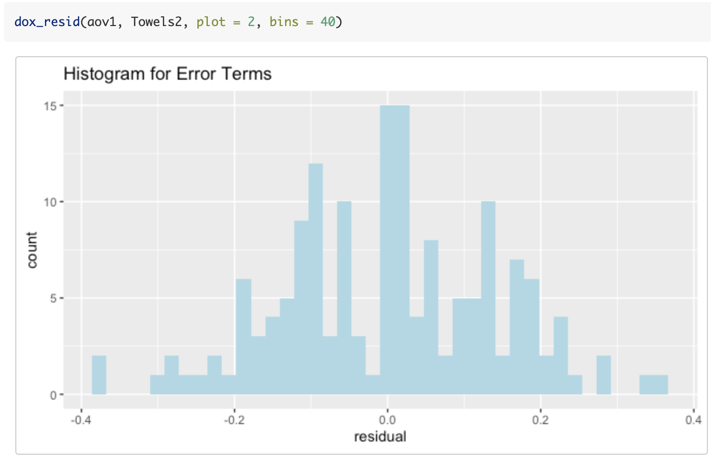

# easydox
When you analyze and visualize your experiments, are you always bored with creating nice, concise, and easy-to-understand visualizations? From assumption checking to effects visualizations, everything can be done in one line with easydox, whether it's three-way ANOVA, block design, or split-plot design!

# Installation
```
# install.packages("devtools")
devtools::install_github("HuandongChang/easydox")
```

# Motivation
When reviewing the packages in R we find that currently there are few user-friendly packages whose interface designs match the way researchers and students cognitively design experiments (Tanaka & Amaliah, 2022). They also do not typically provide meaningful graphics options that address all types of variabilities. Without easily accessible graphics, it becomes challenging to validate the experiment assumptions and statistically analyze the experiment results efficiently, comprehensively, and rigorously. easyExp provides simple but powerful commands for users so that beginners like students can easily gain hands-on experiences and can focus more on experimental designs rather than commands. 


# Functions
**Checking ANOVA Assumptions**


1) equal variances within groups
```
# barplot
dox_boxplot = function(y~x, dataset, color=NULL, facet = NULL)

# scatterplot
dox_scatterplot = function(y~x, dataset, color=NULL, facet = NULL, jitter = FALSE)

# interactive variance table
dox_table = function(y~x1+x2(optional)+x3(optional), dataset)
```


2) normally distributed residuals
```
# A qqplot and a histogram for residuals
normal_err = function(dataset, response, x1, x2=NULL, interaction = TRUE, bins = 30)

# or you can use residuals as input
normal_err = function(residuals, bins = 30)
```

3) independent and identically distributed observations
```
# Residual vs fit/order plots
iid = function(dataset, anova_model)
```

**Main Effect and Interaction Effect Plots**
```
# Main Effect Plots
dox_main = function(dataset, response, x1, x2, x3, ylim)

# Interaction Effect Plots
dox_inter = function(dataset, response, x1, x2)
```


# Datasets Available in the Package
```
# one-way/two-way/three-way anova
Bacteria
Cholesterol
Cups
MemoryA
Movies
Popcorn
Soda
Towels2

# block design/split-plot design
C5Popcorn
Colors
Colors2
Cookies
Cookies2
Corn
Flower
Football
Handwash
Memory
Music
Tennis
```


# Example
You can find a complete example
[here](http://htmlpreview.github.io/?https://github.com/HuandongChang/easyExp/blob/main/vignettes/introduction.html). Some highlights:





# References
Tanaka, Emi, and Dewi Amaliah. "Current state and prospects of R-packages for the design of experiments." arXiv preprint arXiv:2206.07532 (2022).


